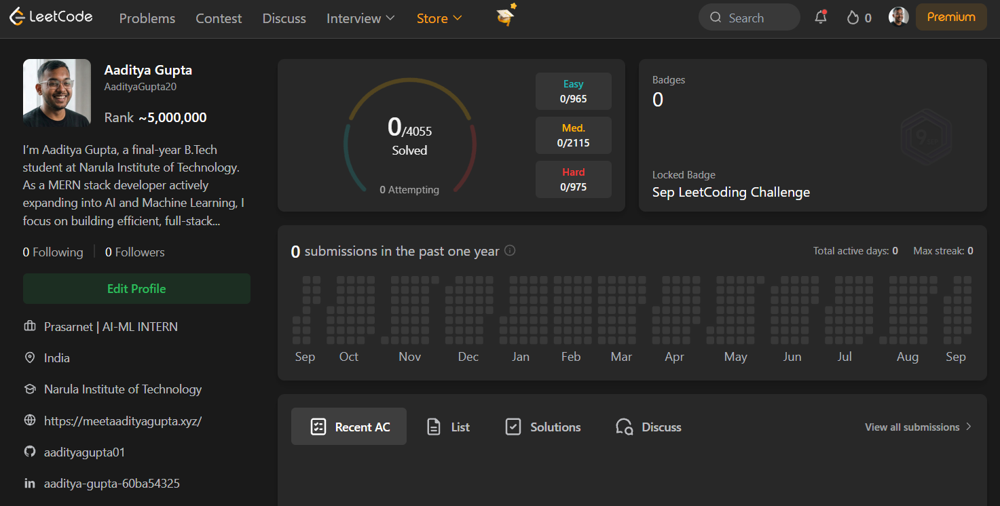

---

## 🧠 The Story So Far

Every strong profile starts with an empty one. This repo is my public commitment to solving LeetCode from the ground up — not to chase a number, but to build real problem-solving instincts that hold up in an actual interview room.

I bring a working foundation as a **MERN stack developer**, with hands-on exposure to **AI/ML**, currently interning as an **AI-ML Intern**. This repo is where I turn that foundation into interview-ready fundamentals — algorithmic thinking, clean code, and the discipline to show up daily.

  

---

## 🎯 Where I'm Starting From

| 🧩 Metric | 📈 Current |
|:---|:---:|
| Problems Solved | **0 / 4055** |
| Status | **Preparing to begin** |
| Focus | **Fundamentals → Patterns → Interviews** |
| Target | **SDE-ready by consistent daily practice** |

> 📌 These aren't stats to be proud of yet — they're the baseline. Every commit from here moves the needle.

---

## 📌 Why This Repo Exists

🔍 Click to see my motivation

 

- 🎯 To build genuine **problem-solving ability**, not just a solved-count
- 🔁 To practice with **structure** — topic-wise, pattern-wise, difficulty-wise
- 📖 To create a **transparent, public record** of real progress, including the slow days
- 💼 To walk into interviews with **muscle memory**, not memorized answers
- 🧗 To prove that consistency — not talent — is what closes the gap

🛠️ What you'll find in this repo

 

- ✅ Daily/weekly solved problems, organized by topic
- 📝 Clean, well-commented solutions with approach notes
- 🧩 Time & space complexity breakdowns for key problems
- 📅 Commit history that reflects real, consistent effort — not a burst before an interview

---

## 🌱 Roadmap

- [x] Set up structured practice repo
- [ ] Solve first 50 problems (Easy foundations)
- [ ] Cross 150 problems — start Medium-heavy practice
- [ ] Build a 30-day active streak
- [ ] Cross 300+ problems — begin Hard problems
- [ ] Mock interview ready

---

⭐ *Follow along if you're on a similar path — consistency is easier when it's not solo.*

